Who is this document for:

This guide is intended for marketplace owners and developers who wish to
trade NFT through their website.

To connect the marketplace to the Polkadot blockchain, you need a REST-
api (unique-SDK) to work with the Unique infrastructure (
[*https://github.com/UniqueNetwork/unique-sdk*](https://github.com/UniqueNetwork/unique-sdk)
).

You also need to familiarize yourself with the corresponding methods of
this library (
[*https://github.com/UniqueNetwork/unique-sdk/blob/develop/packages/web/README.md*](https://github.com/UniqueNetwork/unique-sdk/blob/develop/packages/web/README.md)
) .

Method examples are also available in Swagger (
*https://web-quartz.unique.network/swagger/\#/* ).

Separately, there is an api for loading images for NFT, from where we
will need one method:

[*https://image-uploader.unique.network/api/docs/*](https://image-uploader.unique.network/api/docs/)

How the market and blockchain work.

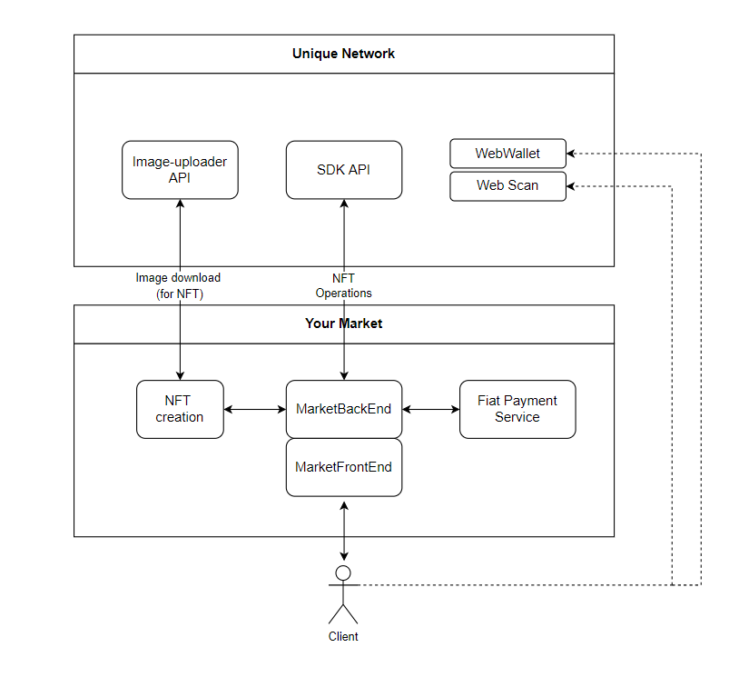


TABLE OF CONTENTS:
- [STEP 1](#Create a market's substrate account)
- [STEP 2](#STEP-2)
  - [STEP 2.1](#STEP-2.1)
  - [STEP 2.2](#STEP-2.2)
  - [STEP 2.3](#STEP-2.3)
  - [STEP 2.4](#STEP-2.4)
  - [STEP 2.5](#STEP-2.5)
  - [STEP 2.6](#STEP-2.6)
  - [STEP 2.7](#STEP-2.7)
  - [STEP 2.8](#STEP-2.8)
  - [STEP 2.9](#STEP-2.9)
- [STEP 3](#STEP-3)
  - [STEP 3.1](#[STEP-3.1)
  - [STEP 3.2](#[STEP-3.2)
- [STEP 4](#STEP-4)
  - [STEP 4.1](#STEP-4.1)
  - [STEP 4.2](#STEP-4.2)
  - [STEP 4.3](#STEP-4.3)
- [STEP 5](#STEP-5)
  - [STEP 5.1](#STEP-5.1)
  - [STEP 5.2](#STEP-5.2)

### STEP 1 Create a market's substrate account
Your marketplace will have to store and transfer NFTs. To do so it is necessary to have a spessial account. 
Unique network operates in 'Substrate' ecosystem. Substrate account addresses (Polkadot, Kusama, Unique, Quartz etc.) may look different on different networks but they have all the same private key underneath. You can see all transformations of any address on https://polkadot.subscan.io/tools/ss58_transform\\Unique substrate address.

There are several ways to create a Substrate account address:
- [*https://polkadot.js.org/extension/*](https://polkadot.js.org) - you will get an account and an extension for your Chrome or Firefox browser in order to quickly connect to any Unique network webs (recommended) 
- [*https://wallet.unique.network/*](https://wallet.unique.network/) - you will get an account, but will have to manualy connect it to other Unique network webs
- using API [*https://polkadot.js.org/docs/ui-keyring/*](https://polkadot.js.org/docs/ui-keyring/) - you will get only an account

It is vety important to keep your account seed phrase safe! Write it down on paper or export the JSON key with a password you would never forget.

The account creating steps are the same for eather way, the example of UI in https://wallet.unique.network/:

#### STEP 1.1

Go to [*https://wallet.unique.network/*](https://wallet.unique.network/)
and click on the "Create substrate account" button

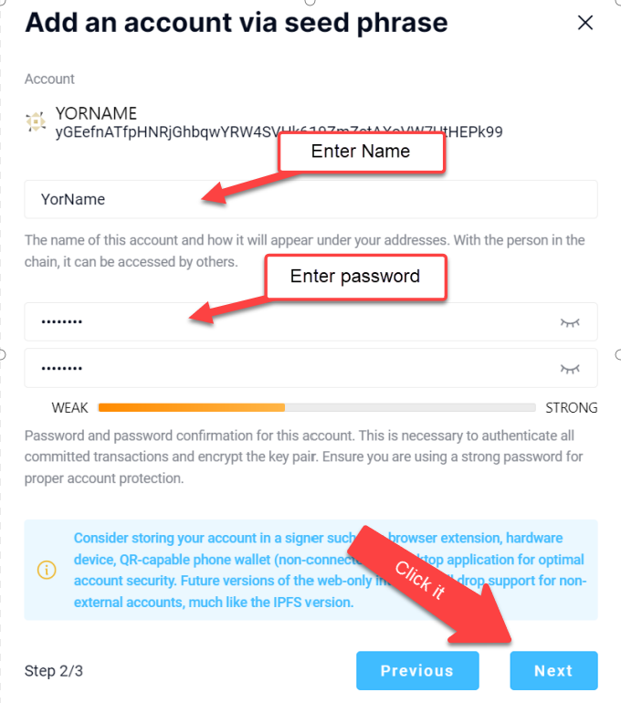

#### STEP 1.2

When creating an account, the type "Mnemonic" is selected and a secret
phrase of 12 words is automatically generated.

You need to write down these words in a safe place.

After that, mark the checkbox "I have saved my mnemonic seed safely". Press "NEXT"
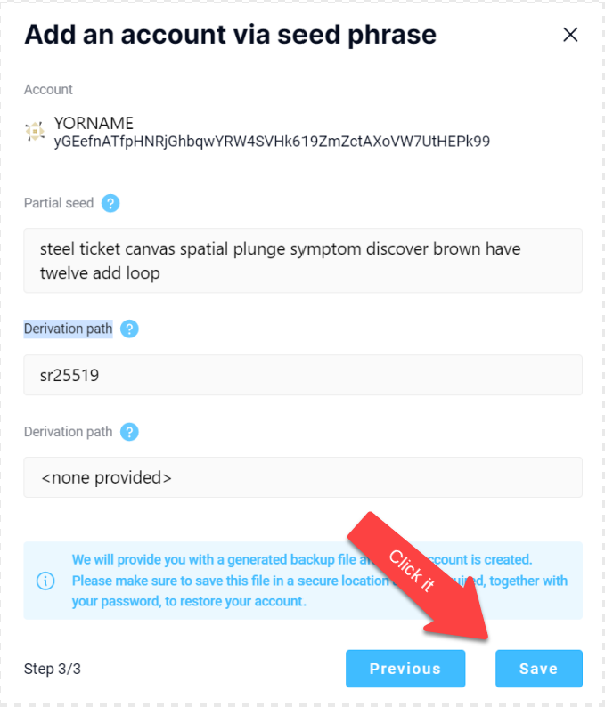

#### STEP 1.3

Think up and enter your name and password. Press "NEXT"

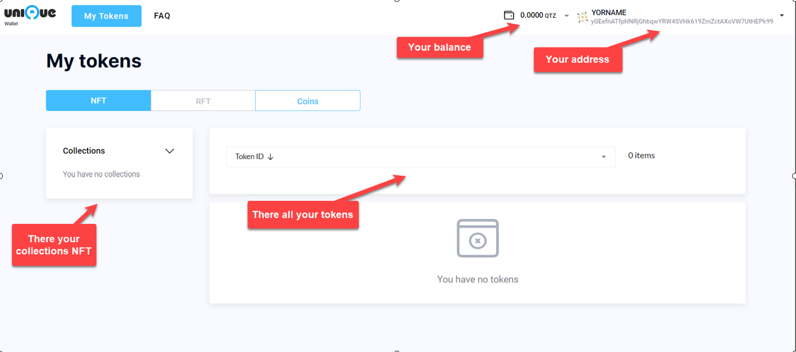

#### STEP 1.4

Log in to your account using your credentials (credentials already
entered). Press "SAVE"
button.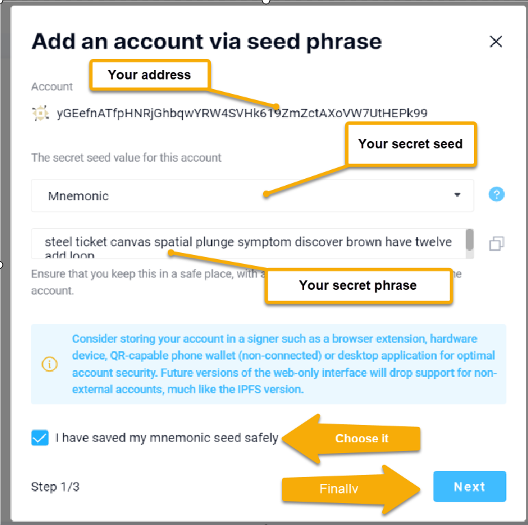

You now have your substrate account address!

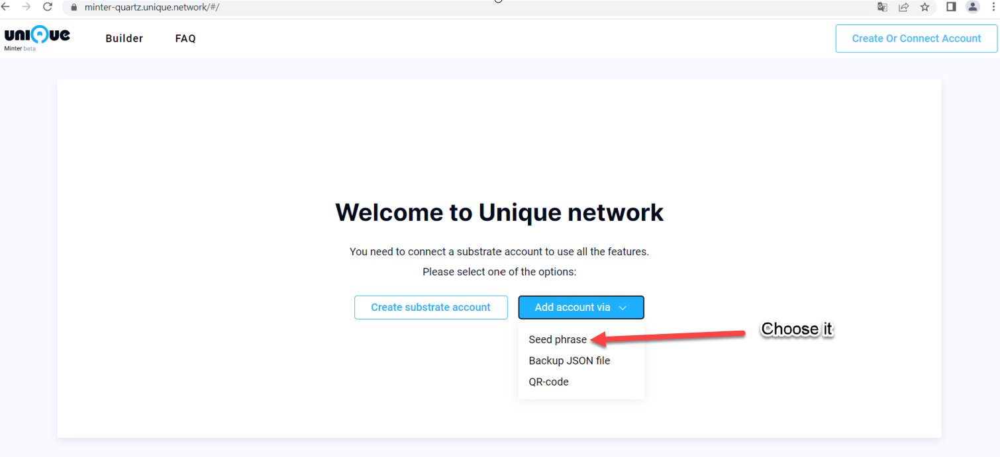

### STEP 2 Create an NFT collection

All NFTs in Unique network are organized in collections. You can create as many collections as you want and orginize them by any principle: one collection per market/artist/albom/event/theme etc.

There are several ways to create a collection: 
- using Unique Minter UI [*https://minter-quartz.unique.network/*](https://minter-quartz.unique.network/)
- using SDK
- using custom scripts 

We recommend to start with using the Unique Minter UI.

#### STEP 2.1

Go to the minter at [*https://minter-quartz.unique.network/*](https://minter-quartz.unique.network/)
and connect an account you've created via polkadot.js extension or following "Add account via" instructions.

Attention! To create collections, you must have QTZ coins in your
account!

To get QTZ coins, you can request them using the bot:
[*https://t.me/unique2faucet\_opal\_bot*](https://t.me/unique2faucet_opal_bot)


To create a collection, click the "Create new" button.


#### STEP 2.6

Next, you need to enter the name of your collection, a description of
the collection, and a short name for the collection tokens.

Press the "Confirm" button.

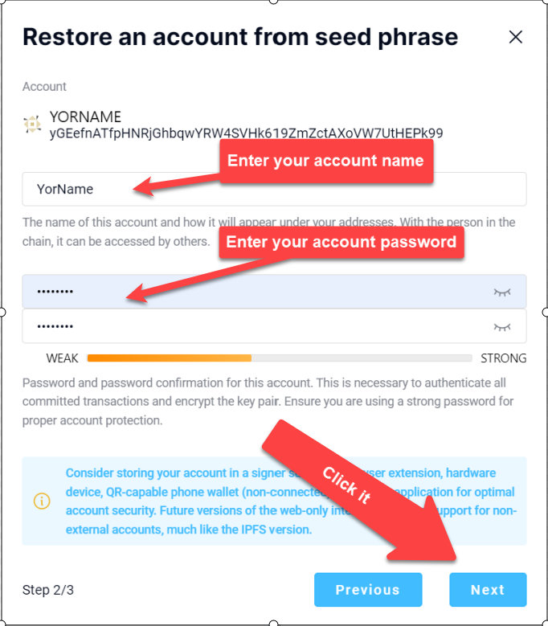

#### STEP 2.7

Next, you need to load the collection icon.

Click on the "Confirm" button.

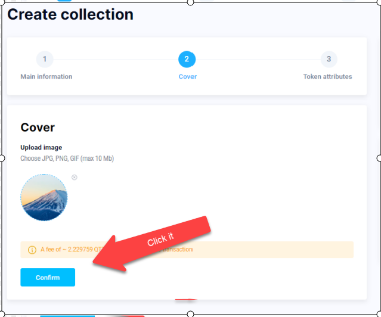


#### STEP 2.8

Next, you need to set the names of the fields in future tokens and click
the "Confirm" button.

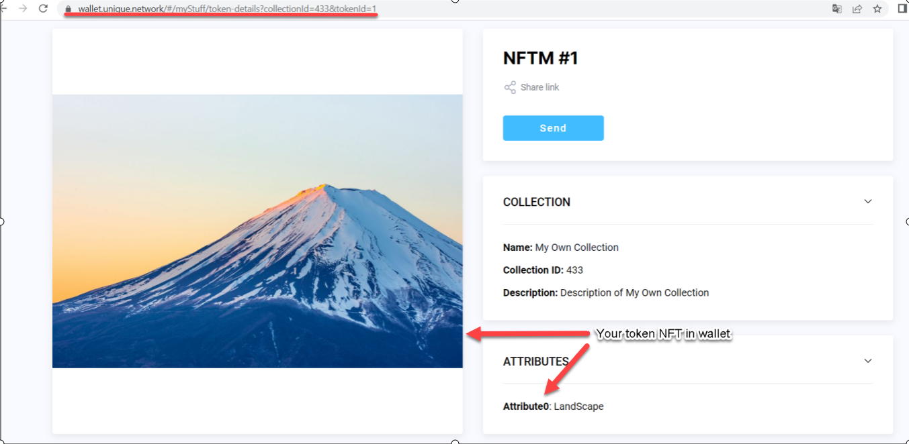
#### STEP 2.9

Next, signing the transaction, you must enter your password and click
the "Sign and submit" button.

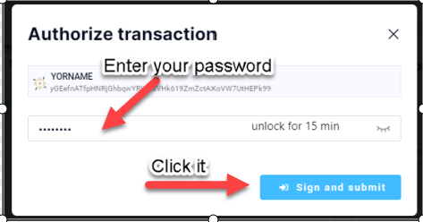

You need to wait about 1 minute. Then your collection will appear.

You are now the owner of an empty NFT collection!

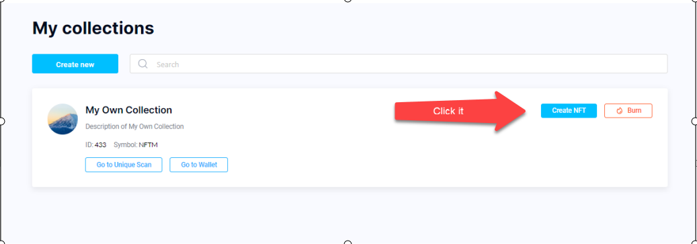

### STEP 3

Creation of the NFT token.

#### STEP 3.1

To create an NFT token, you need to click on the “Create NFT” button.


#### STEP 3.2

Next, you need to upload your NFT image, enter the name of the image and
click the "Confirm" button.

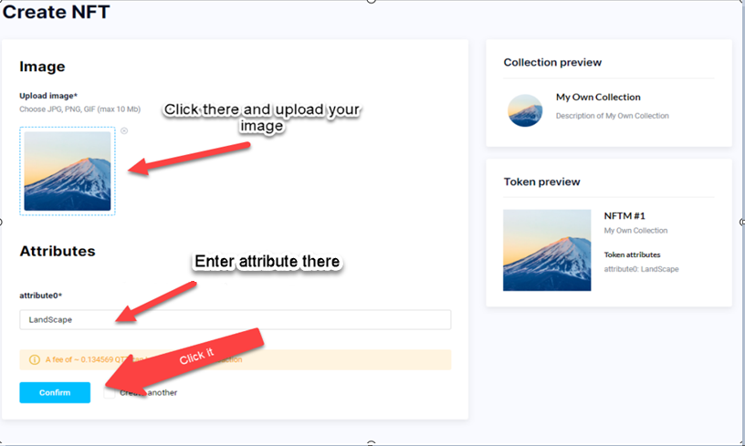

Then sign our transaction for the creation of the NFT, similar to step
2.8.

You now have your first NFT token, which can be seen here:

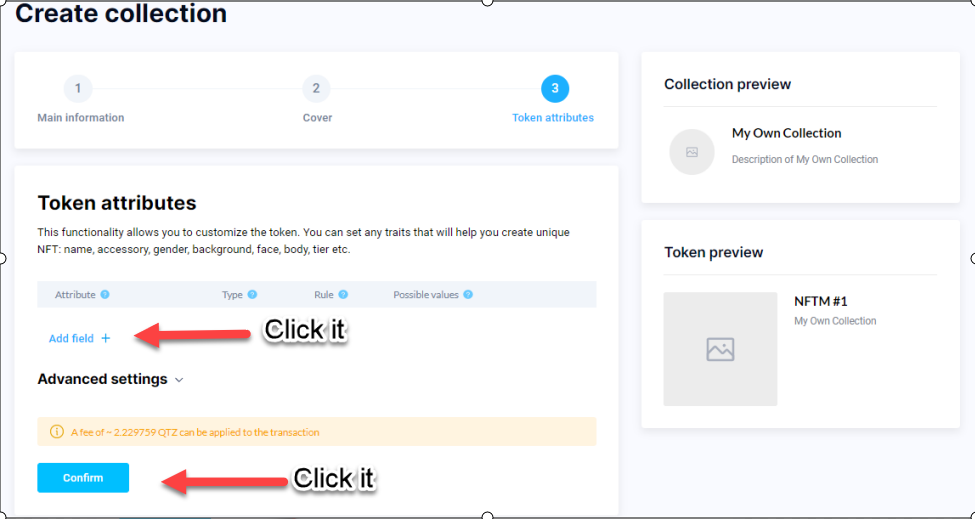

After that, our collection and the NFT token appear in our substrate
address:

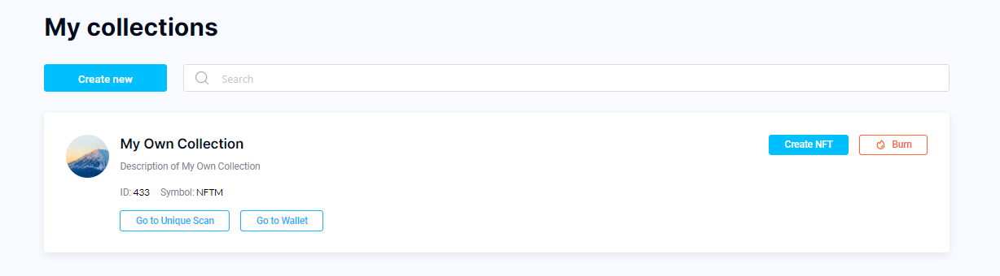


It is now possible to connect NFT token trading to your marketplace.

To do this, we must use the swagger
https://web-quartz.unique.network/swagger/\#/ and as a guide to action -
the REST API documentation:
https://github.com/UniqueNetwork/unique-sdk/blob/
develop/packages/web/README.md .

You need to do the following:

### STEP 4

Creation and signing of an extrinsic.

For requests to change the status of a token in the blockchain, you must
use an extrinsic.

#### STEP 4.1

To create an extrinsic, use PATCH /token for transfer NFT\

#### Request body

```json
{
  "collectionId": 1,
  "tokenId": 1,
  "from": "string",
  "to": "string"
}
```

<details>
 <summary>▶ CURL Example</summary>
  
```bash
curl -X 'PATCH' \
  'https://web-quartz.unique.network/token/transfer' \
  -H 'accept: application/json' \
  -H 'Content-Type: application/json' \
  -d '{
  "collectionId": 1,
  "tokenId": 1,
  "from": "string",
  "to": "string"
}'
```
</details>


#### Response
<details>
  <summary>▶ Http Status 200</summary>

```json
{
  "signerPayloadJSON": {
    "address": "yGCyN3eydMkze4EPtz59Tn7obwbUbYNZCz48dp8FRdemTaLwm",
    "blockHash": "string",
    "blockNumber": "string",
    "era": "string",
    "genesisHash": "string",
    "method": "string",
    "nonce": "string",
    "specVersion": "string",
    "tip": "string",
    "transactionVersion": "string",
    "signedExtensions": [
      "string"
    ],
    "version": 0
  },
  "signerPayloadRaw": {
    "address": "yGCyN3eydMkze4EPtz59Tn7obwbUbYNZCz48dp8FRdemTaLwm",
    "data": "string",
    "type": "bytes"
  },
  "signerPayloadHex": "string"
}
```

</details>

So we created the extrinsic.

#### STEP 4.2

Signing extrinsic.

To sign an extrinsic, use the POST /extrinsic/sign method

#### Request body

```json
{
  "signerPayloadHex": "string"
}
```

<details>
 <summary>▶ CURL Example</summary>

```bash
curl -X 'POST' \
  'https://web-quartz.unique.network/extrinsic/sign' \
  -H 'accept: application/json' \
  -H 'Content-Type: application/json' \
  -d '{
    "signerPayloadHex": "string"
  }'
```
</details>

#### Response
<details>
  <summary>▶ Http Status 200</summary>

```json
{
  "signature": "string",
  "signatureType": "sr25519"
}
```

</details>


#### STEP 4.3
Send the signed extrinsic to the chain.

For this, the POST /extrinsic/submit method is used.

#### Request body

```json
{
  "signerPayloadJSON": {
    "address": "yGCyN3eydMkze4EPtz59Tn7obwbUbYNZCz48dp8FRdemTaLwm",
    "blockHash": "string",
    "blockNumber": "string",
    "era": "string",
    "genesisHash": "string",
    "method": "string",
    "nonce": "string",
    "specVersion": "string",
    "tip": "string",
    "transactionVersion": "string",
    "signedExtensions": [
      "string"
    ],
    "version": 0
  },
  "signature": "string",
  "signatureType": "sr25519"
}
```

<details>
 <summary>▶ CURL Example</summary>

```bash
curl -X 'POST' \
  'https://web-quartz.unique.network/extrinsic/submit' \
  -H 'accept: application/json' \
  -H 'Content-Type: application/json' \
  -d '{
   "signerPayloadJSON": {
    "address": "yGCyN3eydMkze4EPtz59Tn7obwbUbYNZCz48dp8FRdemTaLwm",
    "blockHash": "string",
    "blockNumber": "string",
    "era": "string",
    "genesisHash": "string",
    "method": "string",
    "nonce": "string",
    "specVersion": "string",
    "tip": "string",
    "transactionVersion": "string",
    "signedExtensions": [
      "string"
    ],
    "version": 0
  },
  "signature": "string",
  "signatureType": "sr25519"
}'
```
</details>


#### Response
<details>
  <summary>▶ Http Status 200</summary>

```json
{
  "hash": "string"
}
```

</details>


### STEP 5

Now there is the possibility of transactions with NFT tokens.

To work with NFT tokens on the marketplace, the following interaction
scheme is offered:

(precondition – the marketplace client has a substrate address)

- The marketplace client wants to buy an NFT token of his physical
picture;

- He selects his painting and presses the "buy NFT" button (must exist);

- Next, the client pays for the NFT in fiat, upon receipt of payment,
the marketplace owner creates an NFT token on the blockchain and
transfers the ownership of the token to the buyer.

For this:

#### STEP 5.1

Creation of NFT token (if you create NFT tokens in minter, you can skip
this step).

POST /token

```
POST /token
```

Creates an unsigned extrinsic to create a token inside the collection

#### Request body

```json
{
  "collectionId": 1,
  "address": "yGCyN3eydMkze4EPtz59Tn7obwbUbYNZCz48dp8FRdemTaLwm",
  "constData": {
    "ipfsJson": "{\"ipfs\":\"QmS8YXgfGKgTUnjAPtEf3uf5k4YrFLP2uDcYuNyGLnEiNb\",\"type\":\"image\"}",
    "gender": "Male",
    "traits": [
      "TEETH_SMILE",
      "UP_HAIR"
    ]
  }
}
```

<details>
 <summary>▶ CURL Example</summary>
  
```bash
curl -X 'POST' \
  'https://web-quartz.unique.network/token' \
  -H 'accept: application/json' \
  -H 'Content-Type: application/json' \
  -d '{
  "collectionId": 0,
  "address": "string",
  "constData": {}
}'
```

</details>
  

#### Response
<details>
  <summary>▶ Http Status 200</summary>

```json
{
  "signerPayloadJSON": {
    "address": "yGCyN3eydMkze4EPtz59Tn7obwbUbYNZCz48dp8FRdemTaLwm",
    "blockHash": "string",
    "blockNumber": "string",
    "era": "string",
    "genesisHash": "string",
    "method": "string",
    "nonce": "string",
    "specVersion": "string",
    "tip": "string",
    "transactionVersion": "string",
    "signedExtensions": [
      "string"
    ],
    "version": 0
  },
  "signerPayloadRaw": {
    "address": "yGCyN3eydMkze4EPtz59Tn7obwbUbYNZCz48dp8FRdemTaLwm",
    "data": "string",
    "type": "bytes"
  },
  "signerPayloadHex": "string"
}
```

</details>


Your token has been created!

*After executing this method, you must follow method POST
/extrinsic/sign (STEP 4.2) and method POST /extrinsic/submit (STEP 4.3)*

#### STEP 5.2

Transfer of ownership of the NFT token to the buyer.

To create an extrinsic, use PATCH /token for transfer NFT\

Generates an unsigned extrinsic for transferring rights to a token

#### Request body

```json
{
  "collectionId": 1,
  "tokenId": 1,
  "from": "string",
  "to": "string"
}
```

<details>
 <summary>▶ CURL Example</summary>
  
```bash
curl -X 'PATCH' \
  'https://web-quartz.unique.network/token/transfer' \
  -H 'accept: application/json' \
  -H 'Content-Type: application/json' \
  -d '{
  "collectionId": 1,
  "tokenId": 1,
  "from": "string",
  "to": "string"
}'
```
</details>


#### Response
<details>
  <summary>▶ Http Status 200</summary>

```json
{
  "signerPayloadJSON": {
    "address": "yGCyN3eydMkze4EPtz59Tn7obwbUbYNZCz48dp8FRdemTaLwm",
    "blockHash": "string",
    "blockNumber": "string",
    "era": "string",
    "genesisHash": "string",
    "method": "string",
    "nonce": "string",
    "specVersion": "string",
    "tip": "string",
    "transactionVersion": "string",
    "signedExtensions": [
      "string"
    ],
    "version": 0
  },
  "signerPayloadRaw": {
    "address": "yGCyN3eydMkze4EPtz59Tn7obwbUbYNZCz48dp8FRdemTaLwm",
    "data": "string",
    "type": "bytes"
  },
  "signerPayloadHex": "string"
}
```

</details>

*After executing this method, you must follow method POST
/extrinsic/sign (STEP 4.2) and method POST /extrinsic/submit (STEP 4.3)*

You have transferred the token to the client!

This is how you work with tokens on the marketplace.
